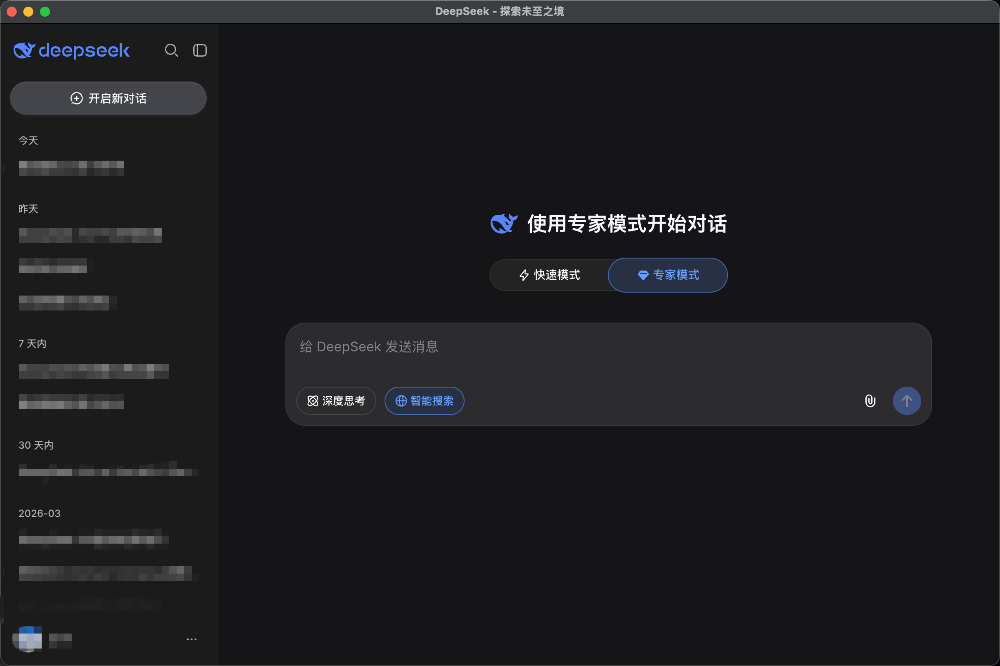

# DeepSeek Desktop

**English** | [中文](README_CN.md)

An unofficial desktop client for [DeepSeek Chat](https://chat.deepseek.com), built with Electron. Supports macOS and Windows.



## Features

- **Native Desktop Experience** — Wraps DeepSeek Chat in a standalone desktop application
- **Persistent Login** — Automatically preserves your login session across restarts
- **System Tray** — Minimize to tray with quick-access right-click menu
- **Global Shortcut** — `Cmd/Ctrl+Shift+D` to toggle window visibility instantly
- **Message Notifications** — Native OS notifications with sound when AI replies
- **Multi-language Support** — Notification text adapts to system language (Chinese/English)
- **Window State Memory** — Remembers window position and size automatically
- **Badge Counter** — macOS Dock badge shows unread message count

## Installation

### macOS

1. Download `DeepSeek Desktop-x.x.x.dmg`
2. Open the DMG and drag the app to your Applications folder
3. On first launch, if you see a security warning, go to **System Settings → Privacy & Security → Security** and click "Open Anyway"

### Windows

1. Download `DeepSeek Desktop Setup x.x.x.exe`
2. Run the installer and follow the setup wizard

## Usage

| Action | macOS | Windows |
|--------|-------|---------|
| Toggle Window | `Cmd + Shift + D` | `Ctrl + Shift + D` |

### Tray Actions

- **Left Click** — Show or hide the main window
- **Right Click Menu** — Open window / New conversation / Quit

### Notification Behavior

- When the window is **not focused** or **hidden**, a system notification pops up upon receiving an AI reply
- Clicking the notification brings the app window to the foreground
- Notification text follows your system language:
  - Chinese systems: "你收到了 DeepSeek 的回复"
  - Other languages: "You received a reply from DeepSeek"

### Quitting the App

- **macOS**: Press `Cmd + Q` or right-click the tray icon → Quit
- **Windows**: Click the window close button or right-click the tray icon → Quit

## Development

### Requirements

- Node.js 18+
- npm 9+

### Local Development

```bash
# Install dependencies
npm install

# Development mode with hot reload
npm run dev

# Build for production
npm run build

# Preview production build
npm run preview
```

### Packaging

```bash
# Package for current platform
npm run dist

# Package for macOS only
npm run dist:mac

# Package for Windows only
npm run dist:win
```

Packaged apps are located in the `dist/` directory.

## Tech Stack

- [Electron](https://www.electronjs.org/) 35
- [TypeScript](https://www.typescriptlang.org/)
- [electron-vite](https://electron-vite.org/) — Vite-based build tool
- [electron-builder](https://www.electron.build/) — Application packaging
- [better-sqlite3](https://github.com/WiseLibs/better-sqlite3) — Local caching
- [electron-store](https://github.com/sindresorhus/electron-store) — Configuration storage

## Project Structure

```
deepseek-desktop/
├── src/
│   ├── main/           # Main process (window, tray, shortcuts, notifications)
│   ├── preload/        # Preload script (secure bridge)
│   └── renderer/       # Renderer injection script
├── resources/          # Icon assets
├── build/              # Build output
├── dist/               # Packaged apps
├── electron.vite.config.ts
├── electron-builder.yml
└── package.json
```

## Disclaimer

This project is a third-party open-source client and is not affiliated with DeepSeek. Usage of DeepSeek services is subject to their Terms of Service.

## License

MIT License

Copyright (c) 2026 Roy Chen
